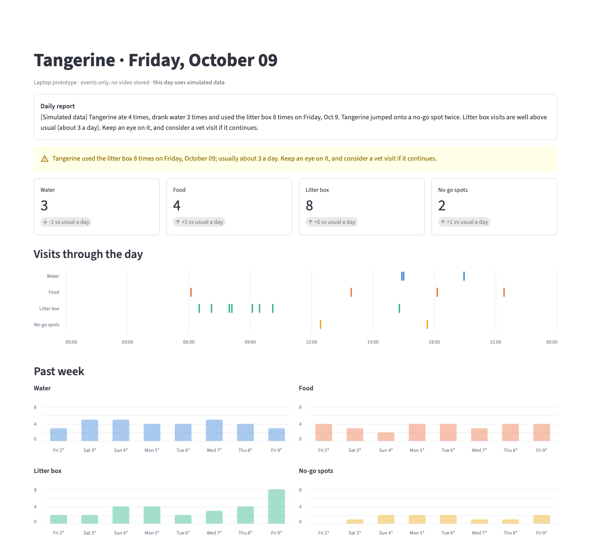

# PawWatch

Edge-AI cat health monitor. Fixed cameras watch the food bowl, water bowl, litter box and no-go spots;
YOLO finds the cat; PawWatch logs every visit, notices when today looks different from the cat's usual week,
rings an alarm when the cat jumps where it shouldn't, and writes a plain-language daily report.
Video never leaves the box: only events are stored.

Built for the **2026 ASUS UGen AI League**. Today it runs on a laptop; the target is a small host with the
ASUS UGen300 (Hailo-10H) accelerator.



*Dashboard on simulated data: a day with extra litter box visits raises an alert.*

## Why

Cats hide pain and illness. Changes in eating, drinking and litter box use are often the first signs, and they
happen while owners are at work. Pet cameras that could catch them upload video to the cloud and charge a monthly fee.
PawWatch does the watching on a box at home and keeps only a log of visits.

## What it does

- **Visit log:** each camera watches one or more zones drawn on its picture. When the cat stays in a zone long enough,
  one visit is logged with its start time and duration.
- **Change alerts:** today's counts are compared with the average of the past 7 days over the same hours, e.g.
  "Litter box visits are well above usual (about 3 by this time)." Only the hours a camera actually filmed are compared.
  Alerts suggest keeping an eye on the cat or seeing a vet; they never diagnose.
- **No-go alarm:** the moment the cat enters a forbidden zone (counter, table, bed), the host plays a sound,
  and optionally sends a text-only Telegram message.
- **Daily report:** a few sentences anyone can read, e.g. "Tangerine ate 4 times, drank water 6 times (2 more than usual)
  and used the litter box 3 times today."
- **Dashboard:** today's counts against the usual, a timeline of visits, and the past week per zone.

## Privacy

- Frames are read, analyzed and dropped. The pipeline never writes an image or video anywhere.
- The database holds one row per visit (camera, zone, start, end) and one row per processed recording (which zones
  were on camera, and when). The dashboard's "What PawWatch stores" panel shows the raw rows.
- No cloud service is needed. The optional Telegram alert sends a sentence of text, never a picture.
- `scripts/check_clip.py` is a camera-setup aid: it saves a few annotated frames locally (`data/check/`) so you can
  check the camera angle. Delete them after setup.

## How it works

```
 cameras, one per spot          detector                   visit logic                    SQLite
 (food, water, litter, ──frame──▶ YOLOv8n, cats only ──box──▶ zone of the cat's center, ──visit──▶ events
  no-go)                         (label, score, box)        dwell and dropout rules        recordings
                                                                   │                         │
                                                                   │ cat in no-go zone       ├──▶ change alerts
                                                                   ▼                         ├──▶ daily report
                                                            alarm: sound, Telegram           └──▶ dashboard
```

| Module | Role |
| --- | --- |
| `pawwatch/detector.py` | Cat detection. Returns `(label, score, (x1, y1, x2, y2))`, the same contract as ASUS's UGen300 demos, so the backend swaps. |
| `pawwatch/zones.py` | Zones file per camera; which zone a point is in. |
| `pawwatch/events.py` | Detections over time to visits: minimum dwell, short dropouts tolerated. Pure logic, no model or video. |
| `pawwatch/run.py` | CLI: video files and a zones file in, visits in SQLite out. `--show` opens the detection window. |
| `pawwatch/store.py` | The events and recordings tables; everything downstream reads through it. |
| `pawwatch/alarm.py` | No-go alarm: sound, optional Telegram, one alarm per jump. |
| `pawwatch/anomaly.py` | Today vs the past week, over the hours that were filmed. |
| `pawwatch/report.py` | Daily report sentences. |
| `dashboard/app.py` | Streamlit dashboard. |
| `scripts/` | Setup and demo tools: camera check, zone drawing, simulated history. |

Timestamps come from the video (recording start plus frame offset), not the processing clock, so recorded footage
replays exactly as it happened.

## Quick start

Requires macOS or Linux and [uv](https://docs.astral.sh/uv/). `uv` installs Python 3.12 and the dependencies:

```bash
uv sync
uv run pytest
```

### See the dashboard with simulated data

```bash
uv run python scripts/seed_fake.py --with-today   # 7 simulated days, plus a day with extra litter box visits
uv run streamlit run dashboard/app.py
```

Simulated days are labeled as such everywhere: faded and starred in charts, "[Simulated data]" in the report.

### Process your own footage

1. Record each spot from a fixed camera, about 1 to 2 m away. Name files with their start time:
   `food_2026-10-09T1830.mp4`. The YOLOv8n weights download on first run.
2. Check the camera angle on a short clip:
   ```bash
   uv run python scripts/check_clip.py data/videos/food_2026-10-09T1830.mp4
   ```
3. Draw the zones once per camera (click the polygon around where the cat's body is while it eats or drinks):
   ```bash
   uv run python scripts/draw_zones.py data/videos/food_2026-10-09T1830.mp4 config/zones/cam_food.json
   ```
4. Run the pipeline. `--show` draws the detection window; leave it off and use `--fps 1` for long recordings:
   ```bash
   uv run python -m pawwatch.run data/videos/food_*.mp4 --zones config/zones/cam_food.json --fps 5 --show
   PAWWATCH_MUTE=1 uv run python -m pawwatch.run data/videos/food_*.mp4 --zones config/zones/cam_food.json --fps 1
   ```
   On a Mac add `--device mps` to use the GPU. A file without a dated name needs `--start 2026-10-09T18:30`.
5. Give the anomaly check a baseline, then open the dashboard. `--end` is the first real day; days with real
   events are never overwritten:
   ```bash
   uv run python scripts/seed_fake.py --end 2026-10-09
   uv run streamlit run dashboard/app.py
   ```
   `--db` (or `PAWWATCH_DB=` for the dashboard) points both at another database.

### Alarm settings

| Variable | Effect |
| --- | --- |
| `PAWWATCH_MUTE=1` | No sound, e.g. for bulk runs |
| `PAWWATCH_ALARM_SOUND=path` | Custom sound file |
| `TELEGRAM_BOT_TOKEN`, `TELEGRAM_CHAT_ID` | Also send a text message; nothing is sent unless both are set |

## Hardware: laptop today, UGen300 next

The prototype runs on a laptop with Ultralytics YOLOv8n. On an M3 Pro, one 1280×720 frame takes 20.5 ms on the CPU
and 5.9 ms on the GPU; three cameras at 5 frames per second need 15 inferences per second.

The deployment target is a Linux mini PC or Raspberry Pi with the ASUS UGen300 (Hailo-10H, 40 TOPS) plugged in.
The port is a new detector backend, not a rewrite: the detector contract matches `ObjectDetector` in ASUS's
[UGen300 demos](https://github.com/erp0917-stack/ugen300-demos), and Hailo publishes YOLOv8 precompiled for the
Hailo-10H, so no training or model conversion is needed. Everything after the detector stays the same.
See [docs/UGen300Notes.md](docs/UGen300Notes.md) for the Python version, files to reuse and known pitfalls.

## Limitations

- One cat per household: several cats get one combined log.
- The 7-day baseline in the demo is simulated, because we recorded about one day of real footage. Real days replace
  simulated ones as footage is processed.
- Cameras must stay fixed: zones are pixel coordinates.
- PawWatch spots changes in routine. It is not a medical device and does not diagnose.

## Team

- [@meander](https://github.com/meander): vision (detection, zones, visits, pipeline)
- [@illumeow](https://github.com/illumeow): output (alerts, report, alarm, dashboard)
- [@bbwinner](https://github.com/bbwinner): slides and research

Product description, plan and hardware notes: [docs/](docs/).
